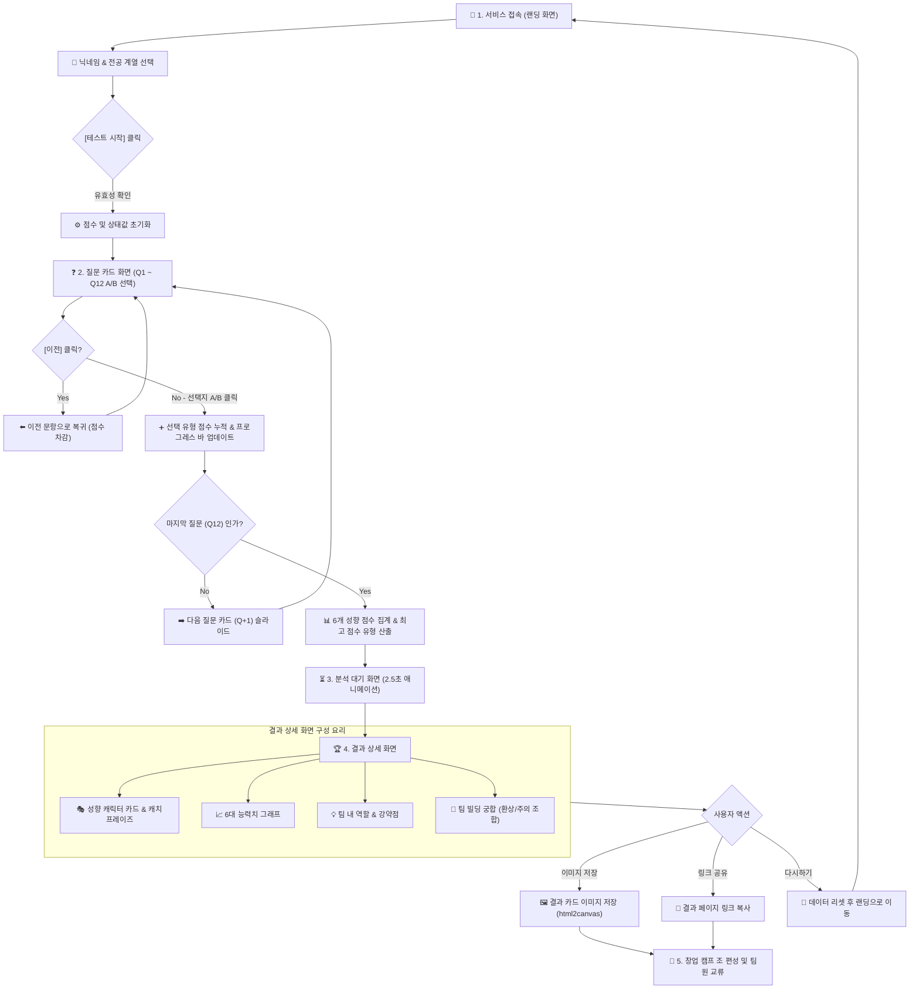
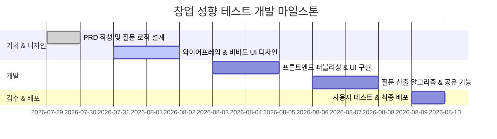

# 🚀 대학생 창업 성향 테스트 웹사이트 PRD (Product Requirement Document)

> **문서 정보**
> - **프로젝트명**: 대학생 창업 캠프 맞춤형 창업 성향 테스트 (Startup Personality Test)
> - **작성자**: 대학생 창업 교육 전문 기획자
> - **작성일**: 2026년 7월 29일
> - **버전**: v1.0
> - **상태**: 작성 완료 (prd.md)

---

## 📌 1. 프로젝트 개요 및 목적 (Executive Summary)

### 1.1 배경
대학생 창업 캠프나 해커톤에 참여하는 대학생들은 저마다 뛰어난 가능성과 열정을 가지고 있습니다. 그러나 **"내가 창업 팀에서 어떤 역할을 잘 수행할 수 있는지", "나와 상호보완적인 팀원은 누구인지"** 스스로 명확히 파악하지 못한 채 팀 빌딩을 진행하는 경우가 많습니다. 이로 인해 팀 내 역할 중복이나 커뮤니케이션 불협화음이 발생하곤 합니다.

### 1.2 목적
본 프로젝트는 **대학생들이 흥미롭게 몰입할 수 있는 상황극 질문(10~12문항 A/B 선택)**을 통해 자신의 창업 성향을 6가지 캐릭터로 진단하고, 캠프 내에서 **효율적이고 조화로운 팀 빌딩(Team Building)**을 도모할 수 있도록 돕는 웹 서비스를 제공하는 것을 목표로 합니다.

---

## 👥 2. 사용자 페르소나 (User Persona)

| 구 분 | 메인 페르소나 (대학생 참가자) | 서브 페르소나 (캠프 퍼실리테이터/운영진) |
| :--- | :--- | :--- |
| **이름/나이** | 김스타 (22세, 대학 3학년) | 박멘토 (31세, 창업 캠프 기획 운영자) |
| **특징** | 창업에 관심이 많지만 실제 팀 프로젝트 경험은 적음 | 50여 명의 참가자를 10개 팀으로 균형 있게 조 편성해야 함 |
| **NPD (Need)** | 내가 무슨 역할을 잘하는지 알고 싶음, 나와 잘 맞는 팀원을 찾고 싶음 | 학생들의 성향을 직관적으로 확인하고 상호보완적인 조 편성을 지도하고 싶음 |
| **Pain Point** | 기존 성향 검사(MBTI 등)는 창업 상황에 직관적으로 와닿지 않음 | 학생들끼리 친목 위주로 팀을 짜서 특정 성향(예: 아이디어만 넘치는 팀)에 쏠림 |

---

## 🎭 3. 6가지 창업 성향 유형 (Personality Types)

대학생 창업 팀의 핵심 6대 역할에 맞춰 성향을 분류합니다.

```
       [ 💡 아이디어형 ]         [ 🛠️ 제작형 ]
       (Visionary Innovator)   (Maker / Tech Builder)
              \                     /
               \                   /
  [ ⚡ 실행형 ] --- [ 창업 성향 6유형 ] --- [ 📊 전략형 ]
(Action Driver)       /           \      (Business Strategist)
                     /             \
       [ 🤝 협업형 ]         [ 🔍 분석형 ]
   (People Facilitator)      (Data & Risk Analyst)
```

1. **💡 아이디어형 (Visionary Innovator)**
   - **한 줄 요약**: "새로운 문제를 발굴하고 끝없는 아이디어를 제시하는 뇌섹남녀"
   - **주요 역할**: 문제 정의, 비전 제시, 아이디어 발상 및 피보팅
   - **강점**: 창의력, 트렌드 캐치 능력, 문제 인식 능력
   - **보완점**: 아이디어가 너무 많아 하나로 모으는 끈기가 필요함

2. **🛠️ 제작형 (Maker / Tech Builder)**
   - **한 줄 요약**: "아이디어를 눈앞에 보이는 실체(MVP)로 만들어내는 연금술사"
   - **주요 역할**: 프로토타이핑, 개발/디자인, 서비스 구조화
   - **강점**: 기술적 구현력, 화면/기능 구체화 능력, 마감 기한 준수
   - **보완점**: 기술적 완벽주의에 빠져 고객 피드백 수용이 늦어질 수 있음

3. **📊 전략형 (Business Strategist)**
   - **한 줄 요약**: "돈이 되는 구조와 시장 판세를 읽는 꼼꼼한 전략가"
   - **주요 역할**: 비즈니스 모델(BM) 수립, 수익 구조 설계, 시장 조사
   - **강점**: 논리적 사고력, 수익 모델 창출, 경쟁사 분석 능력
   - **보완점**: 지나치게 숫자에 치중하여 신선한 아이디어를 조기 매장할 수 있음

4. **🤝 협업형 (People Facilitator)**
   - **한 줄 요약**: "팀의 사기를 북돋우고 매끄러운 분위기를 만드는 팀의 비타민"
   - **주요 역할**: 팀 커뮤니케이션, 발표(Pitching), 고객 인터뷰 진행
   - **강점**: 공감 능력, 설득력 있는 공감 발표, 팀갈등 중재
   - **보완점**: 타인의 의견을 너무 고려하다 결정이 늦어질 수 있음

5. **🔍 분석형 (Data & Risk Analyst)**
   - **한 줄 요약**: "허점을 찾아내고 데이터로 리스크를 막아내는 팩트폭격기"
   - **주요 역할**: 리스크 검증, 타겟 고객 데이터 분석, 사업계획서 검토
   - **강점**: 비판적 사고, 리스크 대비, 데이터 기반 의사결정
   - **보완점**: 비판적 시각이 과할 경우 팀원들의 의욕을 꺾을 수 있음

6. **⚡ 실행형 (Action Driver)**
   - **한 줄 요약**: "생각보다 행동이 먼저! 현장으로 달려가는 돌격대장"
   - **주요 역할**: 현장 실전 검증, 고객 발로 뛰기, 빠른 리소스 확보
   - **강점**: 압도적인 추진력, 발로 뛰는 행동력, 순발력
   - **보완점**: 사전 계획 없이 일단 실행부터 하여 시행착오가 늘어날 수 있음

---

## 🛠️ 4. 기능 요구사항 (Functional Requirements)

### F-1. 시작 화면 (Landing & Intro Page)
- **F-1.1**: 감각적인 헤더 카피("나의 대학생 창업 성향은? 캠프 승률 200% 팀 빌딩 가이드") 제공
- **F-1.2**: 간단한 참가자 정보 입력 (닉네임/이름, 전공 계열 선택: 인문/상경/공학/예체능 등)
- **F-1.3**: [테스트 시작하기] 비비드 3D 버튼 및 참여자 수 카운터 표시

### F-2. 질문 진행 화면 (Quiz Flow Page)
- **F-2.1**: **10~12개 문항**으로 구성 (문항당 몰입감 높은 A/B 2지 선다형)
- **F-2.2**: 상단 프로그레스 바(Progress Bar)로 현재 진행도(예: 3 / 10) 실시간 표시
- **F-2.3**: 선택지 클릭 시 자연스러운 카드 슬라이드/페이드 애니메이션 전환
- **F-2.4**: 실수로 누른 경우를 대비한 [이전 질문으로 돌아가기] 버튼 제공

### F-3. 결과 분석 대기 화면 (Loading Page)
- **F-3.1**: 질문 완료 후 2~3초간 "창업 성향 데이터 분석 중..." 로딩 애니메이션 노출
- **F-3.2**: 위트 있는 팁 문구 무작위 노출 (예: "창업 캠프 성공의 80%는 찰떡같은 팀 빌딩에 있습니다!")

### F-4. 결과 상세 화면 (Result Page)
- **F-4.1**: **최종 결정된 성향 캐릭터 카드** (대표 아이콘, 캐치프레이즈, 유형명)
- **F-4.2**: **창업 성향 세부 능력치 그래프** (6개 성향의 밸런스 차트)
- **F-4.3**: **창업 팀 내 나의 역할 & 강점/주의점 요약**
- **F-4.4**: **대표 유명 창업가 비유** (예: 아이디어형 = 스티브 잡스 스타일, 전략형 = 찰리 멍거 스타일 등)

### F-5. 팀 빌딩 궁합 시스템 (Team Synergy Matching)
- **F-5.1**: **환상의 짝꿍 (Best Combo)**: 나의 단점을 완벽히 보완해 줄 최고의 성향 유형 안내
- **F-5.2**: **티키타카 주의 (Caution Combo)**: 의견 충돌이 생길 수 있어 주의가 필요한 성향 유형과 협업 팁 안내

### F-6. 결과 공유 & 저장 (Share & Action)
- **F-6.1**: **결과 카드 이미지 저장 (Download Card)**: 결과 카드를 한 장의 깔끔한 이미지로 저장하여 조원들에게 자랑하기
- **F-6.2**: **결과 링크 복사 (URL Copy)**: 팀원들에게 카카오톡/단톡방으로 바로 공유
- **F-6.3**: **다시 테스트하기 버튼**: 초기화 후 재진행

---

## 📱 5. 비기능 요구사항 (Non-Functional Requirements)

| 구 분 | 세 부 요 구 사 항 |
| :--- | :--- |
| **UX/UI 디자인** | **트렌디 & 비비드 (Trendy & Vivid)** 스타일<br>- 대학생 대상의 위트 있고 알록달록한 감성 그래픽<br>- 모바일(스마트폰) 화면 중심의 모바일 퍼스트 반응형 웹 |
| **아키텍처** | **프론트엔드 단독 (Client-Only)**<br>- 별도 서버/DB 없이 브라우저 내에서 즉시 성향을 산출하여 딜레이 없는 쾌적한 UX 제공<br>- HTML/CSS/Vanilla JS 또는 Vite+React 기반의 가벼운 웹 |
| **속도 & 성능** | 첫 로딩 시간 1.5초 이내, 질문 전환 애니메이션 60fps 유지 |
| **접근성 & 직관성** | 어렵고 딱딱한 경영/창업 용어 배제, 직관적인 대화체 및 카드 형태 UX 적용 |

---

## 📐 6. 질문 구조 및 성향 산출 알고리즘 (Quiz & Scoring Algorithm)

### 6.1 문항 예시 (상황극 A/B 선택)

> **[Q1. 아이템 선정 단계]**
> 팀원들과 첫 아이디어 회의시간, 당신이 먼저 꺼내는 말은?
> - **[A]** "요즘 대학생들이 진짜 불편해하는 획기적인 새로운 아이템이 하나 떠올랐어!" ➡️ **(💡 아이디어형 +1, ⚡ 실행형 +1)**
> - **[B]** "우선 최근 성공한 스타트업 모델이랑 우리가 노릴 수 있는 시장 규모부터 조사해보자." ➡️ **(📊 전략형 +1, 🔍 분석형 +1)**

> **[Q2. 멘토 피드백 단계]**
> 창업 멘토님에게 "이 아이디어는 현실성이 떨어진다"는 혹평을 들었을 때 당신의 반응은?
> - **[A]** "멘토님 피드백의 핵심 리스크가 뭔지 데이터로 재검토하고 BM을 다듬어봐요." ➡️ **(🔍 분석형 +1, 📊 전략형 +1)**
> - **[B]** "팀원들 사기 떨어지지 않게 다독이고, 빠른 피보팅으로 새로운 안을 발표해요!" ➡️ **(🤝 협업형 +1, 💡 아이디어형 +1)**

### 6.2 성향 결정 로직
1. 10~12개 질문 응답 시 각 유형별 스코어가 누적 합산됩니다.
2. 질문이 끝나면 6개 유형 중 **가장 높은 점수를 획득한 유형이 최종 결과**로 산출됩니다.
3. (동점자 처리): 동점 발생 시, 가중치가 높은 핵심 문항의 응답값을 기준으로 우선순위를 결정합니다.

---

## 🗺️ 7. 화면 흐름 및 테스트 진행 과정 상세 (Screen Flow & Test Process)

### 7.1 단계별 화면 진행 절차 (Step-by-Step Flow)

1. **[화면 1] 랜딩 / 인트로 (Landing Screen)**
   - **사용자 액션**: 서비스 접속 ➔ 닉네임 입력 & 전공 계열 선택 ➔ `[창업 성향 테스트 시작하기]` 버튼 클릭
   - **시스템 동작**: 입력값 유효성 검사 ➔ 테스트 상태값(`scores = {idea:0, maker:0, strategy:0, people:0, analysis:0, action:0}`, `currentStep = 1`) 초기화 ➔ Q1 질문 화면으로 전환

2. **[화면 2] 질문 카드 진행 (Quiz Screen - Q1 ~ Q12)**
   - **사용자 액션**: A/B 상황극 선택지 중 1개 선택 (또는 `[이전 질문]` 버튼 클릭)
   - **시스템 동작**:
     - 선택지 클릭 시 해당 유형 점수 누적 `+1`
     - 상단 프로그레스 바(Progress Bar) 실시간 업데이트 (`(currentStep / 12) * 100%`)
     - 카드 좌측 슬라이드 애니메이션 효과와 함께 다음 질문(Q+1) 이동
     - Q12 답변 완료 시 ➔ 결과 산출 로직(최대 점수 유형 파악) 실행 후 로딩 화면으로 전환

3. **[화면 3] 데이터 분석 로딩 (Loading Screen)**
   - **사용자 액션**: 2.5초간 분석 진행상황 대기
   - **시스템 동작**:
     - "당신의 창업 성향 분석 중...", "캠프 꿀팁 데이터 로딩 중..." 텍스트 애니메이션 및 로딩 스피너 작동
     - 6개 성향 점수 비율(%) 및 백분율 능력치 최종 계산 완료

4. **[화면 4] 결과 상세 및 팀 빌딩 가이드 (Result Screen)**
   - **사용자 액션**:
     - 나의 창업 캐릭터 및 6대 능력치 그래프 확인
     - 팀 내 역할, 강점/주의점 및 '환상의 짝꿍' 궁합 확인
     - `[결과 카드 이미지 저장]`, `[링크 복사]` 클릭하여 팀원들에게 공유
     - `[다시 테스트하기]` 클릭 시 초기 화면으로 복귀

---

### 7.2 전체 화면 흐름 순서도 (Mermaid Flowchart)



---


## 🗓️ 8. 개발 구현 및 향후 로드맵 (Roadmap)



---

## 💡 초보자를 위한 PRD 읽기 팁 (Glossary)
- **PRD (Product Requirement Document)**: 만들고자 하는 제품(웹사이트)이 '무엇을 해야 하고 왜 만드는지' 정리한 제품 요구사항 설명서입니다.
- **A/B 선택형**: 질문당 2가지 선택지 중 하나를 고르는 직관적인 테스트 방식입니다.
- **모바일 퍼스트**: 대학생들이 스마트폰으로 접속하는 환경을 1순위로 고려하여 UI를 설계하는 방식입니다.
- **프론트엔드 단독 (Client-Only)**: 서버나 데이터베이스 통신 없이 사용자의 웹 브라우저 안에서 모든 로직을 처리하여 속도가 매우 빠른 구조입니다.
